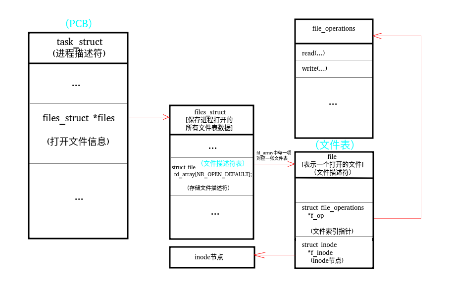

# 文件IO

不带缓冲的IO
每个read和write都调用内核中的一个系统调用
POSIX.1  SUS


## 1 文件描述符

<unistd.h> : STDIN_FILENO 0, STDOUT_FILENO 1, STDERR_FILENO 2

关于文件描述符的一些阐述：



1 操作系统资源分配和调度的基本单位是进程。
2 每个进程由一个PCB进程控制块来描述。
3 在PCB的数据结构中，包含一个files_struct指针，指向用户打开文件表数据结构。这个数据结构里存储了当前进程打开的文件所对应的文件表。
4 在打开文件表的结构中，一个数组表示文件描述符表。其中对应的每一个文件描述符，指向一个文件表项结构体。
5 文件表项结构体中包含fd对应文件的描述，inode节点指针和文件索引指针等。
6 inode结构体中包含文件的具体信息：节点信息，文件长度等

- 说明：

  1 在使用系统调用 open() 打开一个设备节点inode，在内核中会得到一个file，返回文件描述符到文件描述符表。
  
  2 每个进程都有一个文件描述符表，文件表和索引节点存放在内核空间
  
  3 解释：
  
  ​	3.1 文件描述符表：记录进程打开的文件
  
  ​	3.2 文件表：保存进程对文件读写的偏移，存取权限等
  
  ​	3.3 索引节点表：每个表项对应一个具体文件


```c
//从标准输入的文件流中取一个转化成文件描述符
int fileno(FILE *stream);
```


## 2 open & openat
```
返回文件描述符最小未用描述符数值
	
int open(const char *pathname, int flags, mode_t mode);
int openat(int dirfd, const char *pathname, int flags, mode_t mode);
dirfd:	(区分了open和openat)
	1 绝对路径下：直接用open打开目录，用返回值作为openat的第一个参数的值
	2 相对路径下：借用dirfd()，将DIR*转换成int类型的文件描述符
	3 AT_FDCWD : 路径名在当前工作目录下获取
openat作用：
	1 让线程可以使用相对路径名打开目录中的文件
	2 避免TOCTTOU
		TOCTTOU：如果有两个基于文件的函数调用，其中第二个调用依赖于第一个调用的结果，那么程序是脆弱的。

打开文件，重定向流
```

## 3 creat
	等价于 open(path, O_WRONLY|O_CREAT|O_RUNC, mode)


## 4  close
	关闭一个文件会释放该进程加在该文件上的所有记录锁


## 5  lseek
- 每个打开的文件都有一个与其相关联的“当前文件偏移量”，用以度量从文件开始处计算的字节数

- 文件描述符指向的是一个管道、FIFO或网络套接字，则lseek返回-1，errno:ESPIPE

   => 同时检查-1和errno成立才是出错

- 空洞文件：偏移量大于文件当前长度

## 6 重定向命令
```
命令 < 文件	将指定文件作为命令的输入设备
命令 << 分界符	表示从标准输入设备（键盘）中读入，直到遇到分界符才停止（读入的数据不包括分界符），这里的分界符其实就是自定义的字符串
命令 < 文件 1 > 文件 2	将文件 1 作为命令的输入设备，该命令的执行结果输出到文件 2 中
```

## 7 read & write
返回读到的字节数，读到文件尾时返回0

## 8 struct file结构体
pcb->struct file->fd table->fd->file
缓冲区：
	全缓冲：ANSI标准的文件管理函数通过调用malloc函数获得需要使用的缓冲区，默认大小为8192
	行缓冲：在行缓冲情况下，当在输入和输出中遇到换行符时，标准I/O库函数将会执行系统调用操作。默认行缓冲区的大小为1024
	无缓冲
fflush

## 9 文件共享

### 结构
进程表项：fd文件表->文件表项
文件表项：文件状态标志，当前文件偏移量，v节点指针->v节点 / i
i节点：文件所有者，文件长度，指向文件实际数据块在磁盘上所在位置的指针

### 如果两个进程打开了同一个文件则有不同的文件表项，但所指v节点相同）

（在Linux中v节点）

这使得每一个进程可以有自己对该文件的当前偏移量

- 若：write操作超出了文件长度，则i节点设置偏移表示文件偏移
- 若：lseek定位到文件尾端，则文件表项中的当前文件偏移量被设置为i节点中的当前文件长度
	
### 文件状态标志
应用于指向 该给定 文件表项 的任何进程中的 所有描述符

## 10 原子操作
```
是指由多步组成的一个操作

函数 pread 和 pwrite
ssize_t pread(int fd, void *buf, size_t count, off_t offset);
	-> lseek + read
ssize_t pwrite(int fd, const void *buf, size_t count, off_t offset);
	-> lseek + write
```

## 11 dup & dup2
```
复制一个现有的文件描述符
	
int dup(int oldfd);
	返回的新文件描述符一定是当前可用文件描述符中的最小值
	
int dup2(int oldfd, int newfd);
	可用用 newfd 参数来指定新的文件描述符的值
	
这些函数返回的新文件描述符与参数oldfd共享一个文件表项(fd指向同一个文件表项)
```

## 12 sync fsync fdatasync

- 将所有延迟写数据写入磁盘。保证磁盘上实际文件系统与缓冲区中的内容一致
```
void sync(void); 将所有修改过的块缓冲区排入写队列
int fsync(int fd); 只对fd指定的一个文件起作用并且等待写磁盘操作结束才返回
int fdatasync(int fd);只影响文件的数据部分，fsync还会同时更新文件的属性
```

## 13 fcntl

功能：
- 复制一个已有的文件描述符 F_DUPFD , F_DUPFD_CLOEXEC
- 获取，设置文件描述符标志 F_GETFD , F_SETFD
- 获取，设置文件状态标志 F_GETFL , F_SETFL
- 获取，设置异步IO所有权 F_GETOWN , F_SETOWN
- 获取，设置记录锁 F_GETLK , F_SETLK , F_SETLKW

开启文件状态标志
时钟时间：进程开始运行到结束时钟走过的时间  = 阻塞时间+就绪时间+运行时间
用户CPU时间：用户的进程获得了CPU资源以后，在用户态执行的时间
系统CPU时间： …… ， 内核态的执行时间
用户CPU时间+系统CPU时间 = 运行时间


## 14 ioctl	
```c
// 对设备非文件操作的 控制函数
int ioctl(int fd, unsigned long request, ...);
```

## 15 /dev/fd

/dev/fd 是一个虚拟目录，它里面是当前进程所使用的文件描述符信息。而打开里面的文件则相当于复制文件描述符。

打开文件 /dev/fd/n 等效于复制文件描述符n （假定n是打开的）
复制的和原来的同属性
命令行参数：“ - ” 表示标准输入