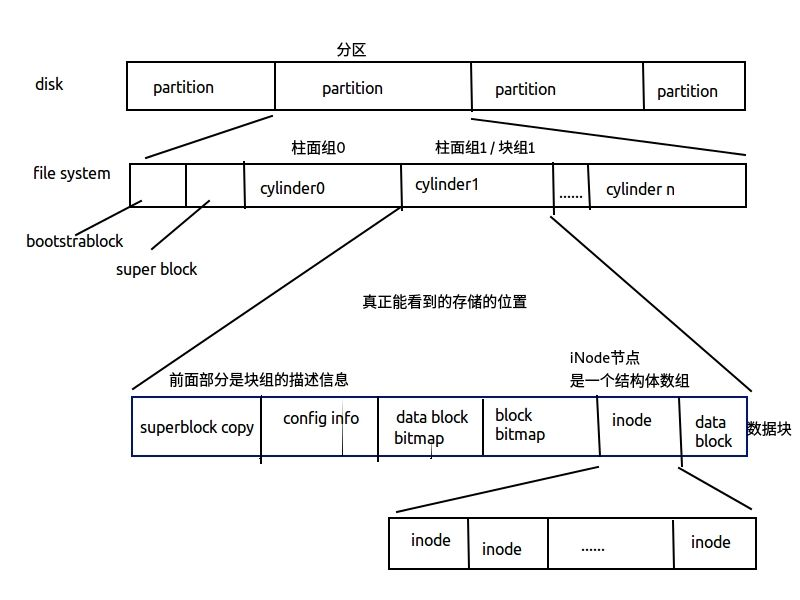

# 文件和目录

```
stat , fstat , fstatat , lstat
struct stat 

access, faccessat

umask
chmod，fchmod，fchmodat

chown fchown fchownat lchown

truncate, ftruncate

link, unlink

remove, rename renameat

symlink, symlinkat
readlink, readlinkat

futimens utimensat utimes

mkdir mkdirat rmdir

opendir, fdopendir， readdir, readdir_r, rewinddir， closedir, telldir, seekdir
ftw, nftw
glob, globfree, struct glob_t

chdir fchdir getcwd
```


- 目录和文件
- 系统数据文件和信息
- 进程环境


## 1  函数 stat , fstat , fstatat , lstat
```c
// 返回与此命名文件有关的信息结构
// - stat 获取文件名，将文件属性填到一个结构体stat中，面对符号链接文件时获取的是所指向文件的属性
int stat(const char *pathname, struct stat *buf);

// fd所指向的文件
// - fstat 通过文件描述度获取属性
int fstat(int fd, struct stat *buf);

// 当命名文件是一个符号链接时，lstat返回该符号链接的有关信息，而非其引用的文件的信息
// 但是将符号链接作为stat和fstat的参数对象时，则返回符号链接指向文件的亚数据信息
// - lstat 面对符号链接文件时获取的是符号链接文件的属性	
int lstat(const char *pathname, struct stat *buf);

// 为一个相对于当前打开目录（dirfd指向）的路径名返回 文件统计信息
// flag参数控制是否跟随着一个符号链接
// 当设置AT_SYMLINK_NOFOLLOW标志fstatat返回符号链接本身信息。默认情况返回符号链接所指向文件的信息，即根据取值作用和stat与lstat一样
int fstatat(int dirfd, const char *pathname, struct stat *buf, int flags);
```
### stat

```c
struct stat {
	dev_t     st_dev;         /* ID of device containing file */
	ino_t     st_ino;         /* inode number */
	mode_t    st_mode;        /* protection */
	nlink_t   st_nlink;       /* number of hard links */
	uid_t     st_ struct timespec st_atim;  /* time of last access */
	gid_t     st_gid;         /* group ID of owner */
	dev_t     st_rdev;        /* device ID (if special file) */
	off_t     st_size;        /* total size, in bytes */
	blksize_t st_blksize;     /* blocksize for filesystem I/O */
	blkcnt_t  st_blocks;      /* number of 512B blocks allocated */
	
	struct timespec st_atim;  /* time of last access */
	struct timespec st_mtim;  /* time of last modification */
	struct timespec st_ctim;  /* time of last status change */

#define st_atime st_atim.tv_sec      /* Backward compatibility */
#define st_mtime st_mtim.tv_sec
#define st_ctime st_ctim.tv_sec
};
```


## 2  文件类型
```
-	普通文件，
d	目录文件，只有内核可以直接写目录文件
b	块特殊文件，提供对设备 带缓冲的访问，每次访问以固定的长度为单位进行
c	字符特殊文件：提供对设备不带缓冲的访问，每次访问长度可变（sys中的所有设备要没事字符特殊文件要么是块特殊文件
p	FIFO：命名管道
s	socket：
l	符号链接：指向另一个文件
	
-> 文件类型信息包含在 stat结构的st_mode 成员
-> st_mode位图总共15位，0-2：other权限，3-5：group权限，6-8：owner权限，9：沾着位，10：G+S位，11：U+S位，12-14：表示文件类型，15：保留位
-> 可以对st_mode位图与宏相与操作来判断文件类型，例如 stat.st_mode & S_IFREG
-> 可用宏来确定文件类型，宏的参数即为 st_mode（也可用于确定IPC对象类型，例如 S_ISREG(stat.st_mode)
```


## 3  设置用户ID和设置组ID

- 实际用户ID & 实际组ID -> 标识用户身份 ，取自口令文件中的登录项
- 有效用户ID & 有效组ID & 附属组ID -> 决定了文件访问权限
- 保存的设置用户ID & 保存的设置组ID 在执行了 一个程序时包含了有效用户ID有效组ID的副本
```	
文件的所有者 由 stat.st_uid 指定 ， 组所有者 有 stat.st_gid 指定
设置用户ID位 & 设置组ID位
使用宏S_ISUID和S_ISGID来获得U+S和G+S位的状态
```
```
U+S用户权限
	chmod u+s：针对某个程序任何用户都有读写这个程序的权限，other权限的执行位变为s
g+s 群组权限
	chmod g+s：强制将此群组里的目录下文件编入到此群组中，无论是哪个用户创建的文件
o+t
	chmod o+t：t模式，阻止文件被其它的用户给删除
```


## 4  文件访问权限

```
每个文件有9个访问权限：
	用户u、组g、其他o - 读r、写w、执行x
	用户：文件的所有者
使用 chmod 命令来修改权限位
访问文件时文件路径上的目录需要执行权限
在目录中创建/删除文件，必须对目录具有写和执行权限

进程每次打开，创建或删除一个文件时内核就进行文件访问权限测试
	-> su -> u -> g -> o    （根据有效ID）
```


## 5  新文件和目录的所有权

1 新文件的用户ID设置为进程的有效用户ID（通常=用户ID）

2 新文件的组ID由不同标准定义

- 新文件的组ID可以是进程的有效组ID
- 是所在目录的组ID （传递）


## 6  函数access和faccessat
```c
//  按实际用户ID和实际组ID进行访问权限测试
//  (测试当前进程对 pathname 文件是否具有 mode 权限，成功返回 0，失败返回 -1 )
	
int access(const char *pathname, int mode);
int faccessat(int dirfd, const char *pathname, int mode, int flags);
//  mode：F_OK -> 测试文件存在 ， R_OK,W_OK,X_OK位图 测试rwx权限
//  flag：AT_EACESS -> 访问检查用的是 调用进程的有效ID
```


## 7  函数 umask

umask函数为进程设置文件模式创建屏蔽字并且返回之前的值，无出错返回
预设权限（权限掩码）  ->  002：档案-rw-rw-r--目录drwx-rwx-r-x
mode_t umask(mode_t mask);


## 8  函数 chmod，fchmod，fchmodat

命令chmod：
	例如：chmod a+x [filename] : 所有用户都有可执行权限，a表示所有。

```c
int chmod(const char *pathname, mode_t mode);
int fchmod(int fd, mode_t mode);
int fchmodat(int dirfd, const char *pathname, mode_t mode, int flags);
// 在指定文件上进行操作，fchmod在一打开的文件上操作，fchmodat包含chmod操作还可计算相对于打开目录fd的pathname，参数mode位图操作
// 改变文件权限位，有效ID必须等于所有者ID或root权限
```


## 9  粘着位

- t位 ： 给某一个可执行的二进制命令设置当前t位，把某一个命令的使用痕迹进行保留到内存中，加速下次装载的时间 

放到swap分区中，保留行二进制命令的使用痕迹，加速下次装载时间
删除 / 重命名 文件 权限： 
	拥有文件 | 拥有目录 | root
现在 Unix 使用了 Page Cache 技术，可以使常用的数据块驻留在内存中了，所以粘滞位的作用越来越弱化了。

例如：

```shell
$ ls / -l | grep tmp
> drwxrwxrwt  24 root root  4096 7月  10 12:00 tmp
```


## 10 chown fchown fchownat lchown

用于更改文件的用户ID和组ID，如果两个参数owner或group中的任意一个是 -1，则对应的ID不变
```c
int chown(const char *pathname, uid_t owner, gid_t group);
int fchown(int fd, uid_t owner, gid_t group);
int fchownat(int dirfd, const char *pathname, uid_t owner, gid_t group, int flags);
int lchown(const char *pathname, uid_t owner, gid_t group);
```


## 11 文件长度

st_size : 以字节为单位的文件长度
-> 适用于 普通文件，目录文件，符号链接
符号文件 的文件长度：是在文件名中的实际字节数 例如：usr/lib

设置了 环境变量 POSIXLY_CORRECT后，du 报告的是1024字节块的块数，未设置则512字节块数


## 12 文件截断

```c
int truncate(const char *path, off_t length);
int ftruncate(int fd, off_t length);
```


## 13 文件系统

文件链接的概念 --> 文件系统的结构
（i节点 ， 指向i节点的目录项）

一个磁盘可以分成多个分区，每个分区可以包含一个文件系统。
i节点是固定长度的记录项，包含有关文件的大部分信息

### FAT 文件系统

本质上是一个静态存储的单链表

### UFS文件系统



但是UFS不善于管理小文件，当小文件过多inode节点可能会耗尽。查询慢。

- 一个磁盘下可有多个分区

- 一个分区下有多个柱面组（块组）

- 一个块组下的结构：

  描述信息description

  inode位图（以0或1表示inode节点的使用情况）

  数据块位图（与数据块一一对应）

  inode节点（结构体数组）

  数据块（存储有效数据块）

```c
struct inode{
	stat
	亚数据
	无关数据
	数据块指针族[15] { // 15个指针
		[12] : 直接数据块指针	最多指向数据块中的12个小块
        // 如果文件大小超出12个指向空间的总大小，就启用下面的指针
		[3 ] : 	一级数据块指针	指向数据块中的一个小块。一个指针占4字节，这个空间最多可以存放小块大小/4字节的指针个数。其中的每个指针指向一个小块，指向的小块用于存放数据。
				二级数据块指针	指向数据块中的一个小块，指向小块中存储指针，它们分别指向另一个小块中，这些小块中再存储数据块中小块的地址，这些地址才是用来存储数据的。
				三级数据块指针	原理同上。
	}
}
```


### 硬链接（相当于一个文件的指针）
- i节点包含一个链接计数，表示指向该节点的目录项数，链接计数减少至0才可删除
- nlink_t stat.st_nlink  -> 链接计数 
```
硬链接：ln src dst （是目录项的同义词，相当于两个指针指向了同一个数据块）
硬链接与目录项是同义词，且建立硬链接有限制：不能给分区建立（确保inode不重复），不能给目录建立
```


### 符号链接（相当于快捷方式）
- 符号链接文件在数据块中，包含该符号链接所指向的文件的名字
- S_IFLNK
```
符号链接：ln -s （类似与windows下的快捷方式）（link, unlink, remove, rename）
符号链接优点：可以跨分区，可以给目录建立
```


### i节点：
- 类型 ino_t
- 包含了文件所有有关的信息：
文件类型，文件访问权限位，文件长度，指向文件数据块的指针。stat中大部分数据取于此

### 目录

#### 目录的硬链接数

开始为2，（当前目录名，和.)，增加一个子目录则硬链接计数+1，是子目录中的..

#### 目录说明
一个目录包含了一组目录项，目录项存放在data block中，
一个目录项包括了文件名和索引节点号，索引节点号是指向索引节点表中对应的索引节点的
ext文件系统中，目录项存放文件名和一个指向索引节点的指针
索引节点是文件系统处理文件所需要的所有信息都放在成为索引节点的数据结构中
-> 包括：文件属性，所有者，文件建立和修改时间，大小，权限，磁盘位置等

#### 目录项
包含文件的inode号 和 文件名
目录文件：目录项，inode。例如/etc/...解析路径过程：inode2号是根目录，获取其结构体，在根目录下拿到etc目录文件，在重复该过程

### 文件
目录项 + inode + 数据块
- 目录项：文件名+inode节点号
- inode：是文件索引点，包含：文件的基础信息+数据块的指针
- 数据块：文件的具体内容
	
### inode：
```
文件存储方式		
文件存储在硬盘上，硬盘最小存储单位：扇区，每个扇区存储512字节
os在读取硬盘时，一次连续读取多个扇区 即为 “块”
连续8个扇区组成的大小为4kb的一个块 是文件存储的最小单位

inode是存储文件元信息的区域，称作“索引节点”
包含：文件字节数，拥有者UID，GID，文件读写执行权限，时间戳，连接数，文件数据block位置，（除了文件名之外的所有信息

inode大小
块组的一个块的大小一般定义为4k起，一个inode节点指向一个块，128/256字节
```

### 查看文件过程
先从inode表中查出文件属性和数据存放点，再从数据块中读数据


## 14 link linkat unlink unlinkat remove

- ln命令，用于产生硬链接
- ln -s 产生符号链接

```c
//创建一个指向现有文件的链接
int link(const char *oldpath, const char *newpath);
int linkat(int olddirfd, const char *oldpath, int newdirfd, const char *newpath, int flags);

//删除一个现有的目录项
int unlink(const char *pathname);
int unlinkat(int dirfd, const char *pathname, int flags);

//解除对一个文件或目录的链接
int remove(const char *pathname);
```


## 15 rename & renameat

```c
// 用于重命名文件或目录
int rename(const char *oldpath, const char *newpath);
int renameat(int olddirfd, const char *oldpath, int newdirfd, const char *newpath);
```


## 16 符号链接

是对为一个文件的间接指针
符号链接的指向和中对象没有限制，一般用于将文件或整个目录移到sys中另一位置
注意跟随符号链接的函数和非跟随的函数
可能形成文件夹的循环
ls -F 检测link文件 @


## 17 创建和读取符号链接
```c
int symlink(const char *target, const char *linkpath);
int symlinkat(const char *target, int newdirfd, const char *linkpath);
ssize_t readlink(const char *pathname, char *buf, size_t bufsiz);
ssize_t readlinkat(int dirfd, const char *pathname, char *buf, size_t bufsiz);
```

## 18 文件时间
atime 最后访问 read
mtime 最后修改 write
ctime 最后i节点更改 chmod chown


## 19 futimens utimensat utimes

	修改时戳
	时间：atime（读时间, mtime（写时间, ctime（
	更改文件最后 读时间和 写时间


## 20 mkdir mkdirat rmdir


## 21 读目录
```c
// 1
DIR *opendir(const char *name);
DIR *fdopendir(int fd);
struct dirent *readdir(DIR *dirp);
int readdir_r(DIR *dirp, struct dirent *entry, struct dirent **result);
void rewinddir(DIR *dirp);
int closedir(DIR *dirp);
long telldir(DIR *dirp);
void seekdir(DIR *dirp, long loc);

# ftw() , nftw() : 遍历文件层次结构
```

```c
// 2
int glob(const char *pattern, int flags, int (*errfunc) (const char *epath, int eerrno), glob_t *pglob);

void globfree(glob_t *pglob);

// glob_t
typedef struct {
	size_t   gl_pathc;    /* Count of paths matched so far  */
	char   **gl_pathv;    /* List of matched pathnames.  */
	size_t   gl_offs;     /* Slots to reserve in gl_pathv.  */
} glob_t;

// gl_pathv 中存放的是根据 pattern 参数解析出来的所有文件列表的路径，而 gl_pathc 就是 gl_pathv 的数量
// globfree 将 glob 函数产生在 pglob 参数中所申请的内存释放掉
```

### glob的使用 -- 基础 ls

```c
// ls.c
glob_t globres;
int err = glob(argv[1], 0, NULL, &globres);

for(int i = 0; i < globres.gl_pathc; ++i){
	 puts(globres.gl_pathv[i]);
}

globfree(&globres);
```


## 22 chdir fchdir getcwd

```c
// 改变当前工作目录
int chdir(const char *path); // chdir --> (cd) 修改当前进程的工作路径
int fchdir(int fd);

// 返回文件路径
char *getcwd(char *buf, size_t size); // 获取当前路径 --> (pwd)
```


## du

du 分析一个目录所占的文件大小，默认是K