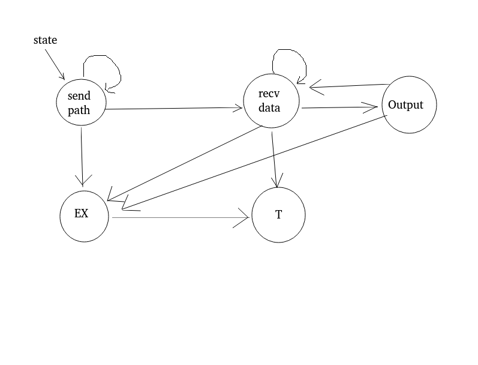

# 进程间通信


## 1  管道

- 管道特点

  内核提供，单工，自同步机制：迁就比较慢的一方（等待较慢的一方

> 1 管道是半双工的，即同一时间数据只能从一端流向另一端。试想，如果一个管道从两边同时输入和输出数据，那么管道里的数据就乱了。
>
> 2 管道的两端一端作为读端，一端作为写端。
>
> 3 管道具有自适应的特点，默认会适应速度比较慢的一方，管道被写满或读空时速度快的一方会自动阻塞。

 

### 匿名管道

pipefd[0]是读端，pipefd[1]是写端
`int pipe(int pipefd[2]);`


//pipe2创建匿名管道， **匿名管道只能用于具有亲缘关系的进程之间通信**
`int pipe2(int pipefd[2], int flags);` 


实例 --> 产生一个匿名管道，用于具有亲缘关系的父子进程间的通信，子进程读管道，父进程写管道


### 命名管道

// P文件，管道文件
`int mkfifo(const char *pathname, mode_t mode);`
权限(mode & ~umask)

相当于对一个普通文件进行读写操作，凑齐读写双方才能继续


## 2  XSI IPC -- System V IPC

Inter-Process Communication

用于进程间通信，查看ipcs命令(ipc show)，ipcrm删除指定的XSI IPC


主动端：先发包的一方
被动端：先收包的一方（先运行


Key ：
想让通信双方拿到同一个通信机制
ftok(哈希值，哈希键) 获取一个key，（产生一个key
```c
// 将一个pathname转换成一个sysv IPC的key
key_t ftok(const char *pathname, int proj_id);
```

--> get op ctl : 创建，使用，控制
--> sem shm msg

例：xxxget中，通过key值产生一个id，通信双方有同一个id表示同一个通信机制

得到同一个key值是为了来创建某一个实例，创建实例拿到id，通信双方用同一个机制进行创建


### Msg 消息队列

Message(双工)
```c
// 创建一个消息队列
int msgget(key_t key, int msgflg);
// 向消息队列发送msgp结构体数据
// msg: 结构体的大小
int msgsnd(int msqid, const void *msgp, size_t msgsz, int msgflg);
// 从消息队列中接收数据
// msgtyp: 表示接收消息的类型
ssize_t msgrcv(int msqid, void *msgp, size_t msgsz, long msgtyp, int msgflg);

//msgbuf 格式如下
struct msgbuf {
	long mtype;    /* message type, must be > 0 */
	char mtext[1];   /* message data */
};

int msgctl(int msqid, int cmd, struct msqid_ds *buf);
```

// ftp
Path ->
Data <-
Data <-
EOT  <-
./s
./c pathfrom pathto
(权限校验，守护进程，状态机，exec)



### Sem信号量数组

```c
semget
semop

struct sembuf{
	sem_num
	sem_op
	sem_flag 
}

semctl
```

适用场景：绑定多个信号量，原子化操作

匿名IPC：主要用于两个具有亲缘关系进程间通信，IPC_PRIVATE


### Shared memory共享内存段
```c
int shmget(key_t key, size_t size, int shmflg);
// 使进程与共享内存关联起来
void *shmat(int shmid, const void *shmaddr, int shmflg);
// 使进程分离共享内存
int shmdt(const void *shmaddr);
int shmctl(int shmid, int cmd, struct shmid_ds *buf);
```


## 3  网络套接字 socket


### 1 跨主机传输

- 字节序（大端，小端）
->  主机字节序: host
网络字节序: network

_ to _ _ : htons, htonl, ntohs, ntohl


- 对齐
指定编译器不对齐

（避免数据包大小不一致发生数据串位等问题）
```c
struct st {
	...
}__attribute__((packed))
```


- 类型长度

int
char
使用通用类型 : int32_t, uint32_t, int8_t, uint8_t


socket:
```c
int socket(int domain, int type, int protocol);

// domain:协议族  -->  AF_INET ...
// type:协议类型  -->  SOCK_STREAM ...
// protocol:协议  -->
```


### 2 报式套接字

socket()
不同协议族对通信地址的约定的类型的地址是不一样的。

```c
int bind(int sockfd, const struct sockaddr *addr, socklen_t addrlen);
int inet_pton(int af, const char *src, void *dst);
inet_ntop()
ssize_t sendto(int sockfd, const void *buf, size_t len, int flags,
const struct sockaddr *dest_addr, socklen_t addrlen);
rcvfrom()
setsockopt()  getsockopt()：// 设置/获取socket选项
```

对于某个指定的sockfd的某一层level中的某一个属性来进行设置


#### 多点通讯：

广播：
全网广播
子网广播

多播/组播：
if_nametoindex : 名字转换为 网络索引号
224.0.0.1 -> 所有支持多播的点默认在该组内并且无法离开

UDP 一般步骤：
Client
1 创建socket
（sockopt来指定发送的方式）
2 sendto

Server
1 创建socket
（sockopt来指定接收方式）
2 绑定本地IP和端口
3 recvfrom

UDP：
丢包：阻塞造成。断点续传
解决方案：闭环流控 -> 停等式流控，（开环流控：没有校验）


### 3 流式套接字
```c
// backlog为半连接池的大小
// 现在变成> 能够接受到的已经建立了全连接的节点有多少（全连接队列的大小）
int listen(int sockfd, int backlog);
// 对端的地址，相当于三次握手之后建立了点对点的传输
int accept(int sockfd, struct sockaddr *addr, socklen_t *addrlen);
```


TIMEWAIT
通过sockopt来控制
SO_REUSEADDR：当bind的时候，发现端口未来得及释放，会马上释放该端口并且使当前绑定成功


3.1 进程并发
在accept后fork，之后要在子进程中关闭

URL			FS

/			/var/www

/cgi-bin/	/var/www/cgi-bin

 

## 4 其他


场景：
从server通过socket发送数据到client，client进程fork出一个子进程，子进程调用exec变成解码器解码流数据，父进程将收到的数据可以通过管道、消息队列等方式传送给子进程